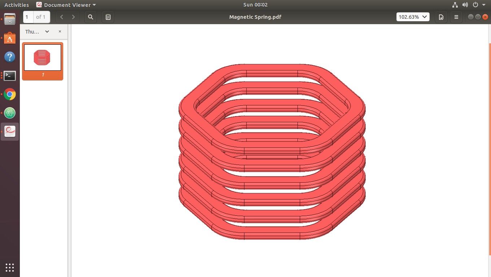
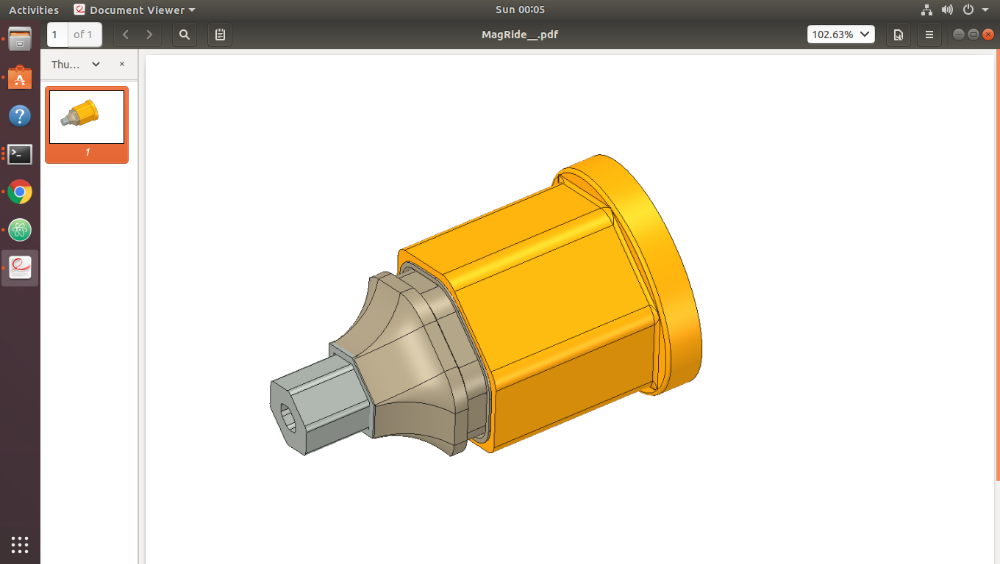
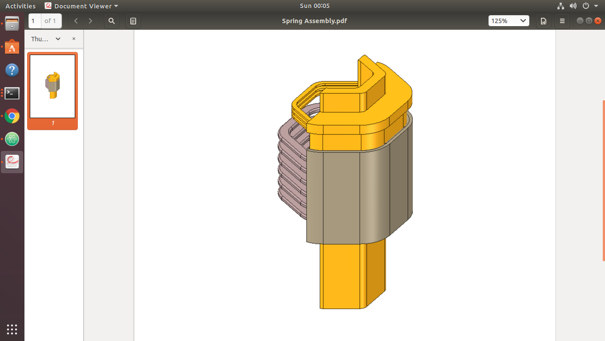

# GMotion

1. **GMotion** offers a multistage damping system for harnessing various stages of suspension action, arising from light bumps on the road to deep potholes or heavy braking. 
2. Each stage has a uniquely designed electromagnetic configuration for optimal conversion of mechanical energy to electrical energy.
3. Energy is transferred to charge controllers then into the vehicle battery bank.
4. Through the use of sensors, proprietary algorithms and an onboard computer,  suspension can be tailored to user driving preferences or automatically adjusted to road or driving conditions.

