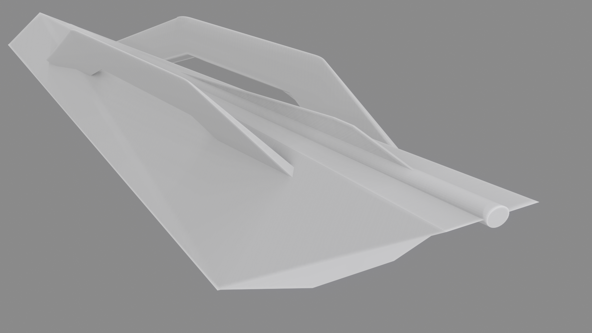
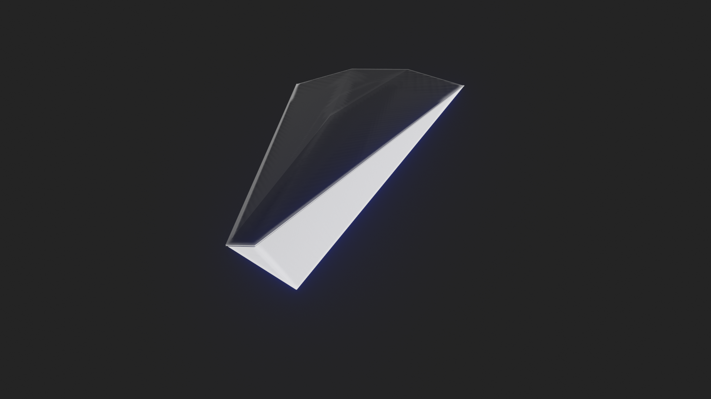

# IIM:Marine One

**IIM Marine One** is the prototype 60-foot platform that will incorporate all **IIM Marine** developments.

Created from aluminium formed using an experimental additive manufacturing process.

**IIM Marine One** intends to be the most cutting edge ocean vessel and the flagship vessel of **IIM Marine**. Due to planned integrations of autopilot technology and powered-winches, a single person should be able to sail **One**.

**One** will be developed in two configurations: _Sail_ & _Powered_.

By designing the boat to be primarily electric, solar and sail powered, **IIM:Marine** **One** is designed to harness huge amounts of sunlight to create concentrated solar energy reserves for heating, utility \( welding for repairs etc \) or defence against pirates.

Solar radiation is harnessed via deck-integrated lens concentrators and thin-film solar cells. Solar PV cells are integrated into the sides of the boat for absorbing ocean-reflected solar energy during the afternoon.

The boat will be fitted with a **10 MW energy storage** capacity and powered by **1000 Kw electric motors**.

We need investors / contributors to make this happen. Please contact quantacomsoftware@gmail.com

