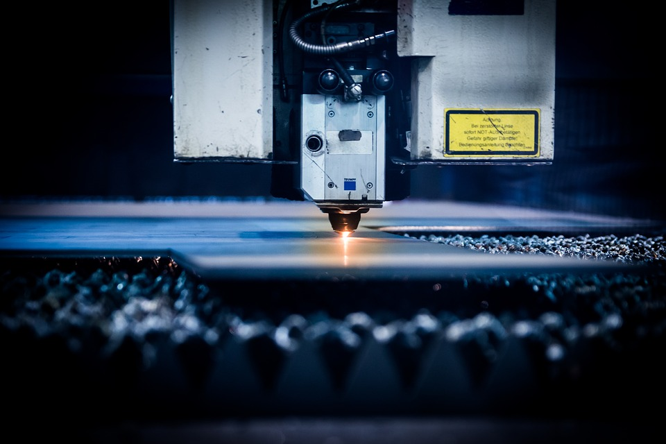

# Photon

### The **IIM**:**Photon** is a concentrated solar laser designed for laser-sintering, welding, smelting and programming and will be used in the [**Frontera** ](https://frontera.iim.technology/projects/manufacturing/leoxmf) Rapid Maufacturing Facility.

Since solar energy is our primary energy source, energy cost is low.

**Photon** is used in conjunction with [**Matrix**](../../manufacturing/matrix.md) in the [**Frontera Rapid Manufacturing Station**](https://frontera.iim.technology)**.**

Photon employs a **twisted hexagonal crystal wave-guide** manufactured from proprietary materials in order to produce novel beam configurations.

Commercial units are planned with the following capacities: **5kW, 15kW, 35kW and 50kW.**

A typical laser configuration consists of a Photon **concentrator** coupled via **laser-fiber** to a Photon head. Using a combination of Quantawave **filters** and **mixers**, various laser types and strengths can be created from the master beam.

The prototype **5kW & 50kW** Photon installations will be built in **South Africa** in **2020.**

The _IIM:Photon_ uses [**batteries for storing energy**](../../energy/energy-storage.md) while the system is inactive and powers auxiliary lasers​ when solar irradiance is low.

 

**See More**









Components

**Lens Unit**

Dimensions : **300mm x 300mm x 300mm**

**​**

**Array**

Dimensions : **1100mm x 1400mm x 300mm**

**​**

**Concentrator**

Dimensions : **1100mm x 1400mm x 300mm**

