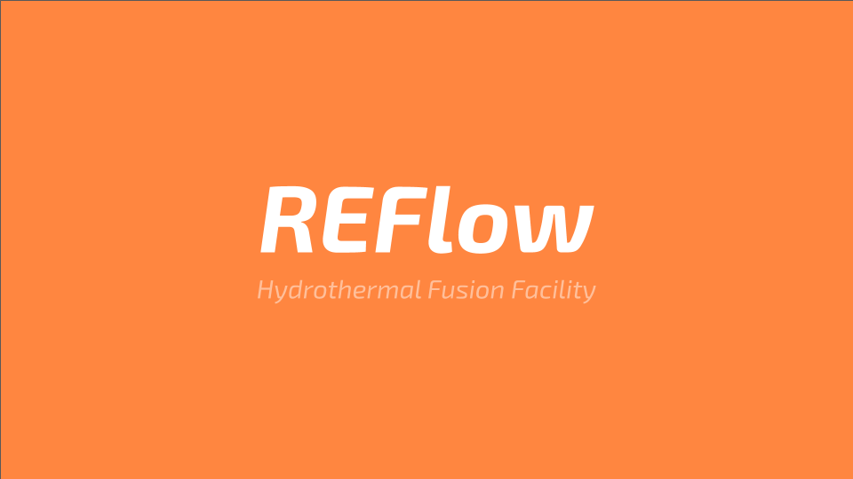

# ReFlow

#### ReFlow is a proposed hydrothermal fusion facility in South Africa for manufacturing fused ceramic, gemstone, crystal products, laser products, lenses and microchip wafers.

Proposal for a high-tech ceramic fusion facility in South Africa for the development of novel stone and alloy based ceramic products.  

**Reflow** aims to leverage the abundance of gemstones and ceramics mined in Southern Africa to create novel new ceramics, crystals and alloys.  
****

**Reflow** utilises **hydrothermal fusion** as its main process and processes the following materials:

* Diamond
* Quartz
* Ruby
* Sapphire
* Tanzanite
* Topaz

Sourced from:

* Mozambique
* South Africa
* Namibia
* Zimbabwe

Technological Improvements to this process are under development and can be seen in the following products and systems:



In addition to this, Quantawave is developing novel laser systems:



The first **Reflow** facility is scheduled for construction in South Africa in 2020, with additional plants scheduled from 2021 in: Mozambique, Zimbabwe, Namibia, Tanzania, Uganda.

